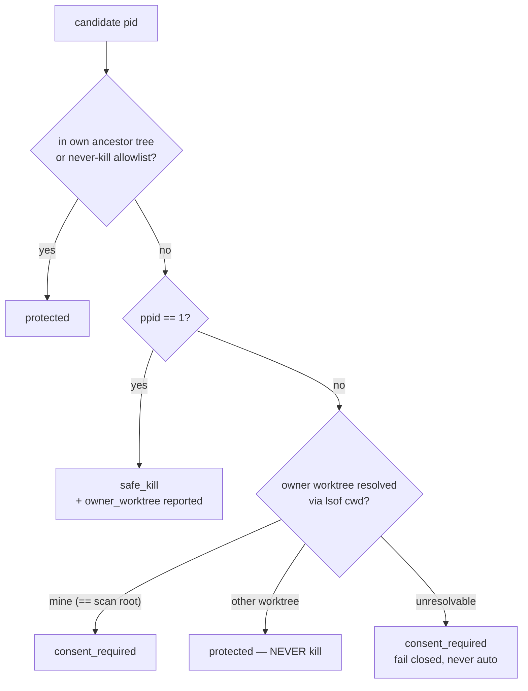
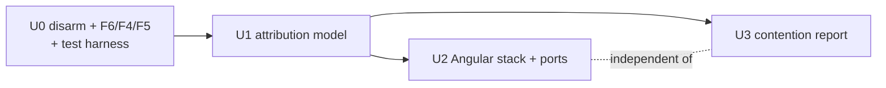

# refactor: clawcrush resource-reclamation redesign (U0–U3)

## Summary

Rebuild clawcrush's zombie-process predicate around a two-axis attribution model (liveness + ownership), after first disarming the destructive paths that currently sit one bug-fix away from an hourly mass-kill of live sessions' MCP servers. Then — and only then — add the Angular/karma/dev-server detection that is the highest-frequency real win, plus a read-only load-contention report.

**Authority note:** `docs/audit-findings.md` (F1–F8, verified by execution) is authoritative over `docs/handoff.md` (directional). The handoff's own top P0 ("add karma/ng-serve patterns, match even when ppid != 1") is deliberately **not** the first unit here: those patterns would land in the broken OR-loop of F1, where a long-running `ng serve` is by definition >60m old and would be flagged while actively serving. Order is U0 (disarm) → U1 (attribution) → U2 (Angular + ports) ∥ U3 (contention report).

---

## Problem Frame

Three verified facts make the current engine dangerous, not just imprecise:

1. **F1 — zero-precision detector.** `scan_zombies` (`scripts/crush.sh:181-187`) treats `ppid==1` OR `age >= 60m` as "zombie" — the `elif` makes age *alone* sufficient. Measured: 14/14 flagged processes were MCP servers of live, healthy Claude sessions; 0 had `ppid=1`. The second loop (`scripts/crush.sh:199-229`) already has the correct AND model (`ppid==1` **and** age, lines 207-212); the MCP loop is one word away from it but needs the fuller model below.
2. **F2 — the mass-kill is armed, and it does not run this worktree's code.** `com.slate.clawcrush` is loaded in launchd (StartInterval 3600) → `~/.slate-queue/jobs/slate-clawcrush` → `~/.slate-queue/scripts/clawcrush.sh`, whose resolver falls back to `~/.claude/plugins/clawcrush/scripts/crush.sh` — a **separate installed copy** (a real git clone of `shawnroos/clawcrush` tracking its own `origin/main`, not a symlink into this worktree; byte-identical to this worktree today, re-verified during planning). `do_cron` (`scripts/crush.sh:628-643`) kills every scanned pid with no confirmation and errors swallowed by `|| true`. It is suppressed today only by a broken `flock` in que-do's boilerplate — a bug, not a safeguard. Merging this plan's code changes into the dev repo does **not**, by itself, change what that installed copy does; see U0's live-machine exit criterion.
3. **F3 — the correct predicate needs two axes.** Liveness (ancestor chain → live `claude` = attached) AND ownership (`lsof` cwd → git worktree). Ownership is a **hard prerequisite** of the Angular work: a sibling worktree's *active* `ng test` and my own *defunct* one are indistinguishable without cwd→worktree attribution.

Supporting hardening: F4 (`do_delete` has no path containment — proven arbitrary out-of-repo `rm -rf`), F5 (`scan_global` dash-decode is lossy; 138/145 live project dirs report as deletable), F6 (bash 3.2 + `set -u` empty-array abort — fails **open** on the dangerous non-empty case, and silently empties output in the automated path), F7 (TOCTOU, `do_kill` input validation, `is_recent` on directories, substring `is_safe`, whole-`ps`-line pattern grep, quote-only JSON escaping), F8 (load-contention diagnosis is real, evidenced, and read-only).

F6 was re-verified during planning: `/bin/bash scripts/crush.sh scan --global` → `json_items[@]: unbound variable`, empty stdout. The fake-process-tree test mechanism was also verified: a child whose parent dies reparents to ppid 1 immediately, and `lsof -a -p <pid> -d cwd -Fn` reliably yields the cwd for worktree attribution.

---

## Requirements

Traceability: F# = `docs/audit-findings.md`; H# = `docs/handoff.md` roadmap item numbers.

- **R1** — Age alone must never mark a process a zombie. Every kill candidate carries a two-axis classification: liveness (orphan ⇔ `ppid==1`) and ownership (owning worktree via `lsof` cwd, owning session via ancestor walk). (F1, F3)
- **R2** — No unattended destructive path until precision is proven: `do_cron` becomes report-only (dry-run to log). This requirement is not satisfied by editing this worktree alone — the armed `com.slate.clawcrush` LaunchAgent resolves to a separately installed plugin copy (see Problem Frame F2, U0's live-machine exit criterion), so R2 also requires either updating that installed copy or tearing the LaunchAgent down. Re-arming is explicitly out of scope for this plan. (F2)
- **R3** — `do_delete` refuses any target outside the scanned root. (F4)
- **R4** — The script is correct under `/bin/bash` (macOS bash 3.2): empty scans emit valid empty JSON with rc=0, in every code path launchd can reach. Must land before U0's dry-run output can be trusted. (F6)
- **R5** — Kill matrix enforced everywhere kills happen (interactive and cron): attached + another worktree = NEVER kill; attached + my worktree = consent only; orphan = safe kill (orphan in another worktree still reported with its owner). The running agent's own process tree and a never-kill allowlist (`npm/pnpm/yarn install`, `tsserver`/LSP servers) are always protected — these are the same predicate, not three features. (F3, H5, H6, ADDENDUM)
- **R6** — Angular/dev-server stack (`karma`, `ChromeHeadless`/`Google Chrome for Testing`, `ng serve`, `ng test`, `vite`, `webpack`, `esbuild`) and port-squatters (listeners on 4200-4299, 9222 with no live owner) are detected and routed **through the R5 classifier** — never through a bare age check. (H1, H2; gated on R1/R5)
- **R7** — SIGTERM grace is tunable by process class: ~2s for known-TERM-resistant browsers, 5s default, then SIGKILL. (H3)
- **R8** — A read-only `contention` mode reports load vs cores and groups contending processes by owning worktree, with a recommendation (e.g., reroute specs to CI). It has zero destructive surface. (F8)
- **R9** — `scan_global` orphaned-ref detection fails closed: a project dir is "orphaned" only when its real cwd is positively resolved (from session JSONL) and that path is gone; unresolvable dirs are never offered for deletion. (F5)
- **R10** — F7 hardening: `do_kill` validates pids (positive integers only) and re-validates classification at kill time (TOCTOU); `is_recent` on a directory considers newest *content* mtime; JSON strings escape backslashes as well as quotes and tracked/untracked file lists are NUL-delimited; process-pattern matching is windowed to the command head, not the whole `ps` line. (F7)
- **R11** — Every safety-critical behavior above has a deterministic **runtime** test (a `tests/` harness run under `/bin/bash`), not a prose assertion. (house rule)

Out of scope (do not build): disk reclaim (handoff P1), worktree pruning (P1), hooks reporting (P3), bg-spare reaping, D/U-state handling, the `cp`/`mv` alias gotcha, `/tmp` ng-serve log sweep (H4 — slop-scan surface, deferred), re-arming the cron.

---

## Key Technical Decisions

- **KTD1 — Crisp orphan predicate: `ppid==1`.** Reparenting to launchd is immediate on parent death (verified), so "no live parent" is exactly `ppid==1`. The ancestor walk is *not* a second liveness heuristic — it serves ownership: which live `claude` session (if any) owns the process, and whether the process is inside the running agent's own tree. Age (`MIN_AGE_MINUTES`, `scripts/crush.sh:20`) is demoted to a display/priority filter and a cron gate (cron acts only on orphans ≥ age) — never a sufficient condition.
- **KTD2 — Classification is computed at scan time and re-validated at act time.** Scan emits `classification` per candidate (`safe_kill` / `consent_required` / `protected`); `do_kill` re-derives it per pid before signaling. `safe_kill` proceeds unconditionally. `consent_required` proceeds ONLY when the caller passes an explicit per-pid `--consent <pid>` flag. `protected` is refused **unconditionally — `--consent` has no effect on a `protected` pid, ever.** There is no caller-reachable path, flag or no flag, to kill a `protected` pid. The `--consent` flag itself may only ever be derived from an explicit **per-item human selection** (lowfat's `AskUserQuestion`); no command layer may synthesize or batch it. Concretely: `fullcream` (definitionally "no confirmation") NEVER passes `--consent` — it acts on `safe_kill` candidates only and reports (never touches) `consent_required` items, the same posture it already has toward `protected`. This closes the TOCTOU window (F7) and makes the safety rule live in ONE place the executor cannot bypass — but that one place can only refuse liberally, not kill liberally; a caller that fabricates a consent flag still gets a real kill, so the human-only-source rule above is load-bearing, not decorative (see Risks).
- **KTD3 — Fail closed on unknowns.** `lsof` failure, cwd gone, cwd not a git repo, unparseable session JSONL → `consent_required` at best, never auto-killed, never auto-deleted. This is the same posture for F5's orphaned-refs.
- **KTD4 — Deterministic test seams as env overrides.** `CRUSH_MIN_AGE_MINUTES` (age gate — **new in U0**: `MIN_AGE_MINUTES` is currently hardcoded at `scripts/crush.sh:20`; U0 adds `MIN_AGE_MINUTES=${CRUSH_MIN_AGE_MINUTES:-60}`, preserving today's default when unset), `CRUSH_SESSION_RE` (ancestor session matcher, default matching `claude` comm basename — real sessions show comm `claude …` or `…/MacOS/claude`, verified), and `$HOME` already parameterizes `scan_global`. A fourth seam, `CRUSH_EXTRA_PATTERNS` (colon-separated, appended to `MCP_PATTERNS`/`DEV_PATTERNS` at scan time), exists for harness-only smoke patterns that shouldn't ship as real detection rules. For everything that DOES ship (MCP servers, U2's Angular stack), tests instead use the **fake-executable technique**: mint a throwaway script literally named after the shipped pattern (e.g. an executable `playwright-mcp`, or `ng` invoked with `test`/`serve` as argv[1]) whose body is `exec sleep 600`, so the windowed argv[0]/argv[1] match (F7 windowing, U1) hits it directly — no env seam needed, and the test exercises the real match, not a synthetic bypass. Fuzzy judgment (what counts as a session) stays in one seam; the crisp decision (kill matrix) is fully testable — the split-fuzzy-from-crisp pattern.
- **KTD5 — bash-3.2-safe idiom, not a shebang swap.** launchd resolves `/bin/bash` regardless of PATH, so the fix is the `${arr[@]+"${arr[@]}"}` guard (or explicit `((${#arr[@]}))` checks) at every array expansion, and the test harness always invokes the script via `/bin/bash` to pin the worst interpreter.
- **KTD6 — Containment root is explicit, per scanned category.** `do_delete` gains a mandatory `--root <path>` argument; every target must realpath-resolve strictly under it. Repo scans pass the repo root. Global cleanup is **not single-rooted**: `scan_global`'s deletable surface spans two disjoint locations — orphaned `~/.claude/projects/<dash-encoded>` refs, and config backups matched at `~/.claude/*.backup*`/`*.bak` (`scripts/crush.sh:471`, depth-1 only) which live **outside** `~/.claude/projects`. A single `--root ~/.claude/projects` fail-closed-refuses every config-backup delete — silently breaking a shipped feature — and widening to `--root ~/.claude` would put `~/.claude/logs` and `~/.claude/settings.json` inside the deletable envelope, which is worse. Fix: `scan_global` emits each item's own authorized root (`"root":"~/.claude/projects"` for orphaned refs, `"root":"~/.claude"` for config backups); the command layer passes that item-emitted root straight through to `do_delete --root`, never a single hardcoded value; and for the config-backup category specifically, `do_delete` additionally requires the target be a **direct child** of `--root` matching the backup glob — not merely somewhere under `~/.claude` — so that root never becomes a general recursive-delete license. No root, no delete.
- **KTD7 — U3 shares U1's attribution helpers but adds no destructive calls.** The `contention` subcommand's code path contains no `kill`/`rm` invocations at all — the read-only property is structural, and the runtime test proves a live candidate survives a contention run.

---

## High-Level Technical Design

### Classifier decision flow (U1)

### Kill matrix (F3, enforced by KTD2)

|                      | orphan (`ppid==1`)       | attached (live parent) |
|----------------------|--------------------------|------------------------|
| **my worktree**      | `safe_kill`              | `consent_required`     |
| **another worktree** | `safe_kill` (+ reported with owner) | `protected` — **NEVER KILL** |
| **owner unknown**    | `safe_kill` (orphan is crisp) | `consent_required` (fail closed) |

Cron (dry-run in this plan) would additionally gate on `age >= MIN_AGE_MINUTES` and only ever consider `safe_kill`.

`--consent <pid>` (KTD2) promotes a `consent_required` pid to killable for that one call, and only that call; it has **zero** effect on `protected` — no flag combination kills a `protected` pid. `--consent` may only ever be constructed from an explicit per-item human selection (lowfat's `AskUserQuestion`); `fullcream` never passes it and therefore never touches `protected` or `consent_required`, acting on `safe_kill` alone.

### Unit dependency graph

---

## Implementation Units

### U0. Disarm the destructive paths (and make output trustworthy)

**Goal:** Nothing clawcrush does unattended can destroy anything **anywhere on the machine**, and every scan emits valid JSON under the interpreter launchd actually uses. This unit lands first, alone.

**Requirements:** R2, R3, R4, R9, R10 (delete-path items), R11.

**Dependencies:** none.

**Files:**
- `scripts/crush.sh` — modify
- `tests/run.sh`, `tests/lib.sh` — create (harness: temp git repos, fake process trees via KTD4's fake-executable technique, `HOME` fixture; always invokes the engine via `/bin/bash`)
- `tests/u0_disarm.test.sh` — create
- `commands/crush-fullcream.md`, `commands/crush-lowfat.md` — update delete invocations to pass each item's own `--root` as emitted by scan (KTD6 — never a single hardcoded value); note cron is report-only
- `commands/crush-setup.md` — stop describing the LaunchAgent as an auto-*killer*; it is a report-only scanner until re-armed (out of scope here)
- **Live-machine artifact (not a repo file, but a U0 exit criterion):** `~/.claude/plugins/clawcrush/scripts/crush.sh` — the installed copy the armed `com.slate.clawcrush` LaunchAgent actually resolves to (Problem Frame F2). Update it (fast-forward that clone from `shawnroos/clawcrush` main after this plan's PR merges) or tear the LaunchAgent down; see below.

**Changes to `scripts/crush.sh` (cite):**
1. **F6 first** — guard every empty-array expansion with the bash-3.2-safe idiom: `scripts/crush.sh:219` and `:234` (`scan_zombies` dedup + output loops), `:417` (`scan_slop`), `:490-491` and `:499` (`scan_global` refs/backups). Reproduced during planning: `/bin/bash scripts/crush.sh scan --global` aborts with empty stdout. Delete the dead `read_crushignore` (`:113-123`) while touching this area.
2. **F2** — `do_cron` (`:628-643`): replace the kill loop with dry-run: log each would-kill candidate (pid, name, reason) to `$CRUSH_LOG`, kill nothing. Every dry-run line is prefixed with the literal marker `Cron dry-run:` (e.g. `Cron dry-run: would-kill pid <pid> reason=<reason>`) — this is the only line shape the new `do_cron` ever emits, and it is not incidental: U0/U1's live-machine verification greps the **installed** copy's source for this exact string to prove it carries the disarmed `do_cron` before that copy's `cron` is ever invoked (see U0 Verification, below). At U0 this list is every raw `scan_zombies` candidate, undifferentiated (no classifier exists yet); U1 (change 6, below) filters it down to genuine `safe_kill` orphans past the age gate — owner/classification fields are added there. Keep the function's output shape so the LaunchAgent and que-do runner stay harmless without modification.
3. **F4** — `do_delete` (`:539-591`): require `--root <path>` as first argument; canonicalize root and each target; refuse (and log `BLOCKED out-of-root`) any target whose real path is not strictly under root. Refuse symlink targets that resolve outside root. `scan_global` emits a per-item `root` field per KTD6 (`~/.claude/projects` for orphaned refs, `~/.claude` for config backups); the command layer passes the item's own `root` through, never a single hardcoded value. For the config-backup category specifically, `do_delete` additionally requires the target be a **direct child** of `--root` matching the backup glob (`*.backup*`/`*.bak`) — never a recursive `~/.claude` license.
4. **F5** — `scan_global` (`:439`): replace the lossy `sed 's/^-/\//; s/-/\//g'` decode. Resolve each project dir's real cwd by reading the `"cwd"` field from its most recent session `.jsonl`; only report `orphaned` when a cwd was positively parsed AND that path no longer exists. Unresolvable → skip (fail closed, R9/KTD3).
5. **F7 (delete path)** — `is_recent` (`:97-110`): for directories, judge by newest content mtime (e.g., BSD `find -mmin -N -print -quit`), not the dir inode — `SLOP_DIRS` (`:44`) are all directories and deletion is recursive. JSON escaping at `:352`, `:409`, `:450`: escape backslashes before quotes; switch `git ls-files` reads (`:257`, `:359`) to `-z` + NUL-delimited loops.
6. **New — `CRUSH_MIN_AGE_MINUTES` env override (KTD4).** `scripts/crush.sh:20`: `MIN_AGE_MINUTES=${CRUSH_MIN_AGE_MINUTES:-60}`. Today `MIN_AGE_MINUTES` is a hardcoded literal — this seam is required by U0's own cron dry-run test and every later unit's age-independence test, and does not exist yet.

**Approach:** This is a pure hardening unit — no behavior improves, everything dangerous stops. The test harness created here is the substrate for U1-U3: helpers to (a) build throwaway git repos, (b) spawn a fake parent script with a `sleep` child and kill the parent to mint a true `ppid==1` orphan (mechanism verified during planning), (c) run the engine under `/bin/bash` and JSON-validate output via `python3 -m json.tool`, (d) mint pattern-matching fake executables named after shipped `MCP_PATTERNS`/`DEV_PATTERNS` entries (KTD4's fake-executable technique) so scan/classify/kill tests exercise the real matching path rather than a synthetic bypass.

**Execution note:** Before trusting any green run, deliberately break each new test once (revert via Edit, not in-script toggles) and see it fail — the harness itself is new.

**Test scenarios (runtime, deterministic; all invoke via `/bin/bash`):**
- F6: `scan --global` and `scan` in a fresh empty temp repo → rc=0, stdout parses as JSON, `slop` is `[]`. (Today: aborts with `json_items[@]: unbound variable`, rc=1, **empty** stdout — the regression case.)
- Cron dry-run: mint a `ppid==1` orphan via KTD4's fake-executable technique (a throwaway executable named after an `MCP_PATTERNS` entry, e.g. `playwright-mcp`, running `sleep 600`; kill its parent so it reparents to ppid 1), `CRUSH_MIN_AGE_MINUTES=0 crush.sh cron` → process still alive afterward; log contains a would-kill line naming its pid.
- Containment: `delete --root <repoA>` with (i) an in-root slop file → deleted; (ii) an absolute path outside root → refused, file intact; (iii) an in-root symlink pointing outside root → refused, link target intact.
- Containment, no root at all: `delete <in-root-slop-file>` with **no** `--root` argument → rc≠0, nothing deleted, file intact, and a `BLOCKED` log line recorded. This is the collapse point of the whole containment model (a stale command layer, an old transcript, or an agent invoking `crush.sh delete <path>` bare must fail closed) and also pins the arg-parsing: a target path that happens to look like a flag (e.g. begins with `-`) must not be silently swallowed as if it were `--root`'s value.
- Containment, config-backup category (KTD6): with a fixture `~/.claude` containing `settings.json`, `settings.json.backup`, and `logs/foo.log` — `delete --root ~/.claude <fixture>/settings.json.backup` → deleted; `delete --root ~/.claude <fixture>/settings.json` → refused (not a backup-glob match); `delete --root ~/.claude <fixture>/logs/foo.log` → refused (not a direct child of root).
- `is_recent` recursion: a `playwright-report/` dir whose only file was written seconds ago → delete refused (today it is `rm -rf`'d — proven in F7).
- F5 fail-closed: with `HOME` pointed at a fixture, a project dir whose JSONL cwd exists → not orphaned; cwd missing → orphaned; no parseable cwd → not orphaned.
- JSON escaping: untracked slop file named with `"` and `\` → scan output parses and the path round-trips exactly.

**Live-machine exit criterion (part of U0's goal, not deployment trivia — do not treat this as follow-up work):** The armed `com.slate.clawcrush` LaunchAgent does not execute this worktree's `scripts/crush.sh` (Problem Frame F2). U0 is not complete until **one** of:
  - **(a) Disarm the live machine directly** — `launchctl bootout gui/$UID/com.slate.clawcrush` (or `bash scripts/setup-quedo.sh --remove`) — done now, kept off until (b) lands; or
  - **(b) Update the installed copy** — merge this plan's PR to `shawnroos/clawcrush` main, then fast-forward the installed clone (`git -C ~/.claude/plugins/clawcrush pull --ff-only origin main`) so `~/.claude/plugins/clawcrush/scripts/crush.sh` carries the disarmed `do_cron`/`--root`-gated `do_delete` before the LaunchAgent is allowed to run again.
  Do (a) immediately regardless of (b)'s timing — U0's point is that nothing destructive runs unattended anywhere on the machine, not just in this worktree.

**Verification:** `tests/run.sh` green under `/bin/bash`. The F2 live-machine check is **route-conditional — read this before running anything against the installed copy; the two routes are not interchangeable and the wrong one is dangerous**:
  - **Route (a) — installed copy not yet updated (the machine's verified current state as of planning).** The check is *solely* `launchctl list | grep clawcrush` returning nothing (LaunchAgent torn down per (a) above). **Do not invoke `~/.claude/plugins/clawcrush/scripts/crush.sh cron` on this route, under any circumstance.** That copy still runs the old, unguarded kill loop — no dry-run, no classifier — and "verifying" by running it is the exact F2 mass-kill this plan exists to prevent.
  - **Route (b) — installed copy updated (U0's live-machine exit criterion step (b) has landed).** First confirm the update, before executing anything against that copy: `grep -q 'Cron dry-run:' ~/.claude/plugins/clawcrush/scripts/crush.sh`. Only if that grep succeeds, run `/bin/bash ~/.claude/plugins/clawcrush/scripts/crush.sh cron` — the exact engine path the plist chain resolves to, not the worktree copy — and assert its log gains `Cron dry-run:` candidate lines and no process dies.
  Running the worktree copy's `cron` and calling that "verified" proves nothing about the live machine (the original mistake this finding corrects); running the *installed* copy's `cron` without first confirming route (b)'s marker is the same mistake in the opposite direction — it mass-kills for real.

---

### U1. Two-axis attribution model (keystone)

**Goal:** Replace the zero-precision predicate with the classifier + kill matrix. After this unit, every process candidate carries `orphan`, `owner_worktree`, `owning_session`, and `classification`, and `do_kill` enforces the matrix at act time.

**Requirements:** R1, R5, R10 (kill-path items), R11.

**Dependencies:** U0 (harness, F6 fix, disarmed cron).

**Files:**
- `scripts/crush.sh` — modify
- `tests/u1_attribution.test.sh` — create
- `CLAUDE.md` — update Safety Rules ("PPID=1 primary, age secondary" → the two-axis matrix)
- `commands/crush-lowfat.md`, `commands/crush-fullcream.md` — render classification/owner columns; lowfat's `AskUserQuestion` **per-item** selection is the ONLY source of the `--consent` flag `do_kill` accepts for `consent_required` items. `fullcream` MUST NOT construct or pass `--consent` for anything — it acts on `safe_kill` candidates only and reports (never touches) `consent_required`, exactly like `protected` (KTD2)

**Changes to `scripts/crush.sh` (cite):**
1. **F1 core** — `scan_zombies` MCP loop (`:181-187`): delete the `elif` age branch. Orphanhood is `ppid==1` only (KTD1). Age becomes metadata (`age_mins` stays in the JSON) and the cron gate.
2. **New helpers** (used by scan, `do_kill`, and later U2/U3):
   - `classify_pid <pid> <scan_root>` → walks ancestors via `ps -o ppid=,comm= -p`, matching `CRUSH_SESSION_RE` (default: comm basename `claude` — verified shapes: `claude bg-pty-host`, `.../MacOS/claude`); resolves owner via `lsof -a -p <pid> -d cwd -Fn` → `git -C <cwd> rev-parse --show-toplevel`; emits the matrix cell per the HTD flowchart.
   - Own-tree protection: at startup compute the script's ancestor pid set; any candidate in it → `protected` (H5).
   - Never-kill allowlist: command matches for `npm|pnpm|yarn` install phases, `tsserver`, `typescript-language-server`, other LSP shapes → `protected` (H6).
3. **F7 (detection precision)** — `:195`: stop `grep -F`-ing the whole `ps` line; window the pattern match to the command head (argv[0]/argv[1]) so a `tail -f x-playwright-mcp.log` is not flagged as an MCP server.
4. **F7 (kill path)** — `do_kill` (`:510-537`): validate every arg is a positive integer (a negative arg is a process-**group** kill today); re-run `classify_pid` per pid immediately before signaling (KTD2/TOCTOU). `safe_kill` proceeds unconditionally. `protected` is refused **unconditionally — no flag, including `--consent`, unlocks it.** `consent_required` proceeds only when an explicit `--consent <pid>` accompanies that pid. Keep SIGTERM → 5s → SIGKILL.
5. **JSON schema** — zombie items gain `"orphan":bool, "owner_worktree":str|null, "owning_session":str|null, "classification":"safe_kill|consent_required|protected"`. `reason` strings become honest (`"ppid=1 (orphaned)"`, `"attached to live claude (pid N), owner: <wt>"`).
6. **F2 completion — `do_cron` routes through the classifier.** U0 landed `do_cron` as dry-run-only, logging every raw `scan_zombies` candidate under the `Cron dry-run:` marker, undifferentiated (no classifier existed yet). U1 filters that list through `classify_pid`: a candidate is logged as a would-kill line only when `classification == safe_kill` **and** `age_mins >= MIN_AGE_MINUTES`; `consent_required` and `protected` candidates are dropped from the dry-run log entirely — cron is unattended and has no consent path, the same posture as `fullcream` (KTD2). This is the concrete implementation the F2 status note's re-arm precondition ("proven by a runtime test") requires, and it is what the new cron test scenario below exercises.

**Approach:** All judgment funnels through `classify_pid`; scan formats, `do_kill` enforces. The handoff's #5 (own tree), #6 (allowlist) and the ADDENDUM's sibling guardrail are implemented as three inputs to this one predicate — not three features.

**Test scenarios (runtime, deterministic; candidate processes are minted via KTD4's fake-executable technique — executables named after real `MCP_PATTERNS`/`DEV_PATTERNS` entries — so tests exercise the real pattern-matching path, not a synthetic bypass):**
- Liveness transition: fake parent (matched via `CRUSH_SESSION_RE` seam) + `sleep` child → classified `consent_required`/attached with correct `owning_session`; kill the parent → same pid reclassifies `safe_kill`/orphan. (Mechanism verified: reparent to ppid 1 is immediate.)
- Ownership: child spawned with cwd in temp worktree B, scanned from worktree A → `owner_worktree` = B, attached → `protected`. Covers the F3 verified live case (sibling session's MCP servers must scan clean at any age).
- Age is not a predicate: with `CRUSH_MIN_AGE_MINUTES=0`, an attached process is still never `safe_kill`; the F1 regression (live-parent MCP flagged by age) asserts zero flagged.
- Unknown owner fails closed: child whose cwd is a deleted directory → `consent_required`, never `safe_kill` unless `ppid==1`.
- Own-tree: the test runner's own ancestor chain → `protected`.
- Allowlist: fake `npm install`-shaped command → `protected` even when orphaned.
- `do_kill` validation: `kill abc` / `kill -- -5` → rc≠0, nothing signaled; `kill <protected-pid>` → refused, process alive; `kill --consent <consent-pid>` → killed; **`kill --consent <protected-pid>` → rc≠0, nothing signaled, process alive** — run against both a sibling-worktree attached pid and an allowlisted pid (e.g. a mid-flight `npm install`-shaped process), proving `--consent` cannot unlock `protected` under any circumstance (this is the single most safety-critical rule in the plan; it must be runtime-tested, not just asserted in prose).
- Windowed match: live `tail -f /tmp/x-playwright-mcp.log` → not flagged.
- Cron routes through the classifier (F2 re-arm precondition, change 6 above): mint one **attached** fake-MCP candidate (a fake parent matched by `CRUSH_SESSION_RE`, i.e. a live fake-session parent, with a `sleep` child) AND one genuine `ppid==1` orphan (KTD4's fake-executable technique, parent killed so it reparents), then run `CRUSH_MIN_AGE_MINUTES=0 crush.sh cron` under `/bin/bash` → the orphan's pid appears in a `Cron dry-run:` would-kill log line; the attached pid appears in **no** would-kill line anywhere in the log; both processes are still alive afterward. This is the deterministic runtime proof — not prose — that post-U1 cron dry-run logs contain only genuine orphans and that attached/consent_required/protected candidates are excluded, which is the exact condition F2's status note names as the re-arm precondition.

**Verification:** On the real machine, `crush.sh scan` during active sessions flags **zero** attached MCP servers (the F1 measurement inverted); the U0/U1 cron dry-run log shows only genuine `ppid==1` orphans as would-kill lines, with attached sessions' MCP servers absent from the log entirely regardless of age.

---

### U2. Angular/dev-server stack + port-squatter detection

**Goal:** The evidenced daily win — karma/ChromeHeadless/`ng serve`/`ng test`/vite/webpack/esbuild and port-squatters become visible and safely killable, routed through U1's classifier.

**Requirements:** R6, R7, R11.

**Dependencies:** U1 (hard gate — these patterns are exactly the class that is legitimately old-and-alive; without the classifier this unit is the F1 disaster amplified).

**Files:**
- `scripts/crush.sh` — modify
- `tests/u2_angular_ports.test.sh` — create
- `commands/crush-lowfat.md`, `commands/crush-fullcream.md` — dev-server table section; per-item consent required for anything outside the current worktree. `fullcream` never constructs `--consent` (U1's restriction) and therefore never touches `protected` OR `consent_required` dev-server candidates — it acts on `safe_kill` only, same as the MCP loop

**Changes to `scripts/crush.sh` (cite):**
1. New `DEV_PATTERNS` array alongside `MCP_PATTERNS` (`:26-40`): `karma`, `ChromeHeadless`, `Google Chrome for Testing`, `ng serve`, `ng test`, `vite`, `webpack`, `esbuild`. Scanned in `scan_zombies` through `classify_pid` — no `ppid` shortcut, no age branch.
2. Port scan: enumerate `lsof -nP -iTCP -sTCP:LISTEN` for 4200-4299 and 9222; each listener classified via `classify_pid`; emit a `ports` JSON section (`{port, pid, command, owner_worktree, classification}`). Squatter = listener classified `safe_kill` (orphan); attached listeners are reported (they explain "port already in use") but obey the matrix.
3. Grace tuning in `do_kill` (`:516-527`): a small class→grace function (browser-class patterns → 2s, default 5s), unit-testable via its own seam; escalation to SIGKILL unchanged (karma/Chrome empirically need it, H3).

**Approach:** Zero new judgment — U2 is pattern supply + a new enumeration source feeding the U1 predicate. The scan JSON grows a `ports` array; zombie items from dev patterns are shape-identical to MCP items.

**Test scenarios (runtime, deterministic; candidates minted via KTD4's fake-executable technique — e.g. an executable literally named `ng` invoked with `test`/`serve` as argv[1] — so tests exercise real `DEV_PATTERNS` matching, not a synthetic bypass):**
- THE regression test (F3/ADDENDUM): an active `ng test`-shaped process owned by sibling worktree B, `CRUSH_MIN_AGE_MINUTES=0`, scan from worktree A → present in report as `protected`, absent from any kill candidacy; `do_kill <its pid>` refused; process alive after.
- Own defunct run: same-shaped process whose parent was killed (`ppid==1`) → `safe_kill`; killed successfully.
- Port squatter: listener on 4287 (e.g., `python3 -m http.server`) minted into orphanhood → appears in `ports` with `classification:"safe_kill"`; attached listener in a sibling worktree → `protected`.
- Grace: TERM-trapping process (`trap '' TERM`) classified browser-class dies within ~2s+ε via SIGKILL; default-class analog takes the 5s path; both dead at the end, elapsed times distinguish the classes.
- Grace-selection seam: browser-class names → 2, others → 5.

**Verification:** On the real machine with a live `ng serve` running in one worktree: scan from a sibling reports it `protected` with correct owner; scan from its own worktree reports `consent_required`; it is never auto-killable. A `lsof`-confirmed dead-parent listener is reclaimed and its port immediately reusable.

---

### U3. Load-contention diagnosis (read-only)

**Goal:** `crush.sh contention` — a report-only mode that explains "load ≫ cores" as N concurrent test/build processes grouped by owning worktree, and recommends rerouting (e.g., CI) instead of killing. (F8: measured load 97.79 on 10 cores during the audit; the field-correct action was reroute, not kill.)

**Requirements:** R8, R11.

**Dependencies:** U1 (reuses `classify_pid`/ownership grouping). Independent of U2.

**Files:**
- `scripts/crush.sh` — modify (new function + dispatch entry at `:647-676`)
- `tests/u3_contention.test.sh` — create
- `commands/crush-lowfat.md` — render the contention section when the ratio is high; recommendation text lives at the command layer

**Changes to `scripts/crush.sh` (cite):**
1. New `scan_contention`: `sysctl -n hw.ncpu`, `sysctl -n vm.loadavg` (1/5/15), enumerate contending process shapes (`ng test`, `tsc`, `karma`, dev builds — reuse `DEV_PATTERNS` if U2 has landed, else a local list) with CPU%, group by `owner_worktree` via U1 helpers. Emit `{cores, load:{1,5,15}, ratio, groups:[{worktree, procs:[{pid, command, cpu}]}], karma_port_clashes}`.
2. New `contention` case in the dispatch (`:647-676`). The function's body contains **no** `kill`, `rm`, or state-changing call (KTD7) — structurally read-only.

**Approach:** Diagnosis, attribution, recommendation — never action. It is the natural partner of the ownership guardrail: it names *whose* processes cause the load precisely so the answer can be "CI", not "crush the siblings".

**Test scenarios (runtime, deterministic):**
- Schema: `/bin/bash scripts/crush.sh contention` → rc=0, JSON parses, `cores` > 0, load floats present, `ratio` consistent.
- Grouping: two `ng test`-shaped dummies in two temp worktrees → both appear, grouped under the correct `owner_worktree`.
- Read-only proof: a killable (`ppid==1` orphan) candidate exists before the run → still alive after; and the scan/log show no kill entries from the contention path.
- Empty case (bash 3.2): no contending processes → valid JSON with empty `groups`, rc=0 under `/bin/bash`.

**Verification:** Run on the real machine during normal work: report matches `uptime`/`sysctl` ground truth; nothing changes state.

---

## Parallelism Analysis

| Unit | May start when | Parallel with |
|------|----------------|---------------|
| U0 | immediately | nothing — lands first, alone |
| U1 | U0 merged | nothing — keystone, single-threaded |
| U2 | U1 merged | U3 |
| U3 | U1 merged | U2 |

- **U0 is strictly first.** Everything else depends on the harness, the F6 fix (trustworthy output), and the disarmed state (safe to iterate on scan logic while an armed cron exists would be reckless).
- **U1 is strictly after U0** and before everything: U2 is hard-gated on the classifier (F3 makes the sibling-active vs own-defunct distinction unimplementable without it); U3 reuses the attribution helpers.
- **U2 ∥ U3** are independent of each other and can run in parallel worktrees. Both touch `scripts/crush.sh` but in low-overlap regions (U2: pattern arrays + port scan + `do_kill` grace; U3: one new function + one dispatch case). Whichever lands second rebases; conflicts should be trivial.

---

## Verification Contract

- `bash tests/run.sh` — the harness itself pins `/bin/bash` (3.2) when invoking the engine; all U0–U3 scenario files green.
- The F1 inversion check on the live machine: `crush.sh scan` during active Claude sessions flags zero attached MCP servers.
- The F2 check is route-conditional (mirrors U0's Verification, above — do not collapse the two routes into one command). If the installed copy at `~/.claude/plugins/clawcrush/scripts/crush.sh` has **not** been confirmed updated (`grep -q 'Cron dry-run:' <that path>` fails or the path predates the marker), the check is *solely* `launchctl list | grep clawcrush` returning nothing — never invoke that installed copy's `cron`. Only once the grep confirms the marker is present may `/bin/bash ~/.claude/plugins/clawcrush/scripts/crush.sh cron` — the exact resolved engine path the plist chain uses, never the worktree copy — be run, asserting it logs `Cron dry-run:` candidate lines and kills nothing.
- The F3 regression: a sibling worktree's active dev process is `protected` end-to-end (scan → table → `do_kill` refusal).
- The F4 check: out-of-root delete refused with the file intact.
- `python3 -m json.tool` accepts every scan/contention output, including empty-result runs under `/bin/bash`.

## Definition of Done

All four units merged; `tests/run.sh` green under `/bin/bash`; the live-machine checks in the Verification Contract pass; `CLAUDE.md` safety rules and the four `commands/*.md` reflect the matrix, the `--root` delete contract, and the report-only cron; re-arming the cron remains unbuilt and is recorded below as follow-up.

---

## Risks

- **PID recycling between classify and signal** (macOS recycles aggressively): mitigated by KTD2 re-validation inside `do_kill`, immediately before `kill`. Residual window is milliseconds and additionally guarded by the classification re-check (a recycled pid almost certainly reclassifies).
- **`lsof` cost per candidate**: scans of many candidates run `lsof -p` per pid. Acceptable at observed candidate counts (≤ dozens); if slow, batch with a single `lsof -a -d cwd -p pid1,pid2,…`. Decide at implementation.
- **`CRUSH_SESSION_RE` default too narrow/wide**: comm shapes verified today (`claude …`, `…/MacOS/claude`) may drift with Claude Code releases. It is a single seam; drift shows up as attached processes classifying `consent_required` (fail closed), never as false `safe_kill`.
- **bash 3.2 regressions reintroduced later**: the harness permanently pins `/bin/bash`, so any new empty-array expansion fails CI-style at test time, on the interpreter that matters.
- **Command-layer drift is asymmetric, not uniformly fail-safe.** lowfat/fullcream markdown must pass consent flags correctly. Drift that **omits** a flag yields refusals (safe). Drift that **fabricates** one — e.g. a future edit to `crush-fullcream.md` that auto-passes `--consent` for every `consent_required` item to satisfy "no confirmation" — yields real kills, because `do_kill` enforces the matrix given whatever flags it receives; it cannot verify a flag's provenance (human selection vs. command-layer synthesis). `protected` is structurally safe regardless (KTD2: no flag unlocks it), but `consent_required` is not. The residual risk is real and must be named honestly: keep `--consent` construction confined to lowfat's `AskUserQuestion` path via code review, since no runtime check in the engine can catch a command file that decides to fabricate it.

## Deferred to Follow-Up Work

- Re-arming `do_cron` (kill mode behind an explicit opt-in) once U1/U2 precision has soaked in dry-run logs.
- `/tmp` ng-serve log sweep (handoff H4) — slop-scan surface, separate plan.
- Disk reclaim (handoff P1), worktree pruning (P1), hooks throughput report (P3).
- Fixing que-do's broken `flock` boilerplate — deliberately untouched here. **Correction (was wrong in an earlier draft of this plan):** the flock bug stays dangerous to fix until U0's live-machine exit criterion has actually landed (installed copy updated, or the LaunchAgent torn down) — merging this plan's code alone does not disarm the live machine (Problem Frame F2), so a repaired scheduler would still invoke the **old**, zero-precision `do_cron` in the installed plugin copy. Do not treat this plan's merge as clearance to fix the flock; treat U0's live-machine exit criterion as that clearance.

## Sources & Research

- `docs/audit-findings.md` — F1–F8, verified by execution; authoritative.
- `docs/handoff.md` (+ ADDENDUM) — directional intent; ADDENDUM promotes ownership/self-scoping to P0 and evidences load-contention diagnosis.
- Planning-time verification on this machine: F6 reproduced under `/bin/bash` 3.2 (`json_items[@]: unbound variable`, empty stdout); child reparenting to `ppid==1` on parent death confirmed; `lsof -a -p <pid> -d cwd -Fn` cwd extraction confirmed; live `claude` comm shapes confirmed (`claude bg-pty-host`, `…/MacOS/claude`); the `com.slate.clawcrush` plist → `~/.slate-queue/jobs/slate-clawcrush` → `~/.slate-queue/scripts/clawcrush.sh` resolver chain traced end to end and confirmed to fall back to `~/.claude/plugins/clawcrush/scripts/crush.sh` — a real git clone of `shawnroos/clawcrush` (not a symlink), `diff` empty against this worktree today.
